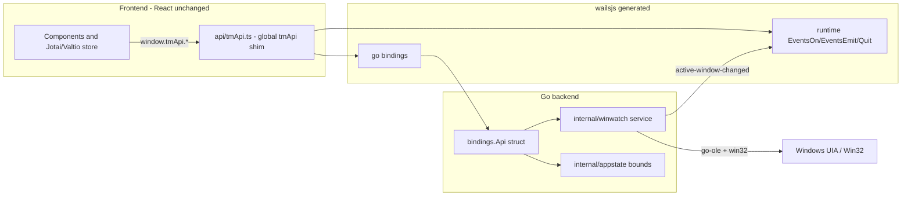

# Wails v2 + Go Migration Plan

Migrate [win-watch-25](C:/y/w/2-web/0-dp/win-watch-25) (Electron + React + C++/NAPI) into the empty workspace `win-watch-26-go` as a **Wails v2 + Go** Windows app. The React UI stays virtually unchanged; the native UI Automation plugin is rewritten in **pure Go** (`go-ole` COM interop, no cgo). Delivery is **phased**.

## Decisions (confirmed)
- Wails **v2** (v2.12.0 already installed).
- **Phased** delivery: scaffold + full UI port + complete `tmApi` Go binding surface first; native UIA methods implemented incrementally.
- Native rewrite in **pure Go** via `github.com/go-ole/go-ole` + `golang.org/x/sys/windows` (no C compiler present).

## The integration seam
The React renderer talks to the backend through a single global, `tmApi` (the `WinWatchApi` interface in [preload-types.d.ts](C:/y/w/2-web/0-dp/win-watch-25/electron/src/preload/preload-types.d.ts)), referenced in only ~8 files. We preserve that exact interface, so UI code is untouched.

- 10 native functions + 1 push event: `getTopLevelWindows`, `getControlTree`, `start/stopMonitoring`, `invokeControl`, `highlightRect`, `hideHighlight`, `getWindowRect`, `getControlCurrentBounds`, `isWindowHandleValid`, and the `active-window-changed` event.
- 5 host functions (currently Electron main): `quitApp`, `zoomAction`, `getZoomLevel`, `onZoomChanged`, `onOpenOptionsShortcut`.

## Target layout (modular, pnpm, git-ready)
- `win-watch-26-go/`
  - `go.mod` - module `github.com/maxzz/win-watch-26` (rename as desired)
  - `main.go` - Wails bootstrap, `//go:embed frontend/dist`, window options
  - `app.go` - `App` struct lifecycle (`OnStartup`/`OnBeforeClose`) wiring bounds + service
  - `wails.json` - frontend install/build/dev commands using **pnpm**
  - `internal/winwatch/` - the native "plugin", independent package
    - `service.go` - `Service` interface + `WindowInfo`/`ControlNode` types (mirror [9-types-tmapi.ts](C:/y/w/2-web/0-dp/win-watch-25/electron/src/renderer/src/store/9-types-tmapi.ts))
    - `windowlist.go` - `EnumWindows` -> top-level windows JSON
    - `monitor.go` - `SetWinEventHook(EVENT_SYSTEM_FOREGROUND)` -> emits active-window changes
    - `highlight.go` - layered overlay window (GDI)
    - `uia/` - `go-ole` IUIAutomation: control tree, invoke, current bounds
    - `win32/` - syscall helpers, `HWND` parse/format (`0x...`)
  - `internal/appstate/bounds.go` - window bounds persistence (replaces [8-ini-file-options.ts](C:/y/w/2-web/0-dp/win-watch-25/electron/src/main/1-start-main-window/8-ini-file-options.ts)); JSON in `os.UserConfigDir`
  - `internal/bindings/api.go` - Wails-bound `Api` struct, 1:1 with `WinWatchApi`, delegates to `winwatch` + emits events
  - `frontend/` - the React app (pnpm package)
    - `src/` = old `renderer/src` (UI virtually unchanged), alias `@renderer` -> `src`
    - `src/api/tmApi.ts` - **new** shim mapping `WinWatchApi` onto `wailsjs` bindings + runtime events; assigned to `globalThis.tmApi`
    - `src/api/tmApi.d.ts` - global type decl (moved from preload-types)
    - `vite.config.ts` (react + `@tailwindcss/vite`), `tsconfig.json`, `index.html`
    - `wailsjs/` - generated bindings + runtime
  - `build/windows/` - `icon.ico`, app manifest (UIAccess deferred), optional NSIS
  - `README.md`, `.gitignore`, `pnpm-workspace.yaml`

## Key adaptations (minimal, transition-only)
- **JSON-string contract preserved**: Go methods return `string` (the same JSON the C++ DLL produced), so the renderer's existing `JSON.parse(...)` logic is unchanged.
- **`tmApi` global**: set `globalThis.tmApi = shim` in [main.tsx](C:/y/w/2-web/0-dp/win-watch-25/electron/src/renderer/src/main.tsx) before render; renderer files keep using the global `tmApi`.
- **Events**: `active-window-changed` via `runtime.EventsEmit`; shim subscribes with `EventsOn`.
- **Zoom + `Ctrl+,` shortcuts** (were Electron main-process): reimplemented as a small frontend `keydown` hook driving the existing zoom atoms ([2-6-atoms-zoom.ts](C:/y/w/2-web/0-dp/win-watch-25/electron/src/renderer/src/store/2-6-atoms-zoom.ts)) and `dialogOptionsOpenAtom`; `zoomAction`/`getZoomLevel`/`onZoomChanged` implemented in the shim (CSS zoom) to satisfy the contract without a Go round-trip.
- **Settings** (theme, panels) already persist via `localStorage` in [8-ui-settings.ts](C:/y/w/2-web/0-dp/win-watch-25/electron/src/renderer/src/store/8-ui-settings.ts) - works unchanged under WebView2.
- **State management**: Jotai + Valtio already used; any new state (e.g., native-readiness/connection status) uses the same libs per the requirement.

## Phased native implementation
- **Phase A (runnable app)**: scaffold Wails+pnpm, port UI, full `Api` binding surface, and implement `getTopLevelWindows`, `isWindowHandleValid`, `getWindowRect`, `start/stopMonitoring` + `active-window-changed`, `highlightRect`/`hideHighlight`. App launches and the window list + active-window monitoring + highlight work.
- **Phase B (UIA depth)**: implement `getControlTree`, `getControlCurrentBounds`, `invokeControl` via `go-ole` IUIAutomation, matching the `ControlNode` shape from [ControlTree.cpp](C:/y/w/2-web/0-dp/win-watch-25/native/src/ControlTree.cpp).
- **Phase C (polish/packaging)**: window-bounds persistence, icon, README, optional NSIS installer and UIAccess manifest (only if needed later).

## Validation
- `wails dev` launches; window list populates; selecting a window shows its control tree; highlight blinks over the selected control; active-window monitoring updates the list.
- `wails build` produces a single Windows `.exe` (expected ~10-20 MB vs Electron's ~150+ MB).
- Compare behavior against the running Electron app for parity.

## Notes / risks
- The UIA COM interop in Go (`go-ole`) is the largest effort; `ControlTree.cpp` (~331 lines) and `ControlHighlighter.cpp` (~291 lines) are the main references to port.
- `uiAccess=true` / code-signing from the Electron README is **out of scope** for the initial port (deferred to Phase C).
- Module path uses `github.com/maxzz/...` as a placeholder; confirm the real GitHub org/repo name before first commit.