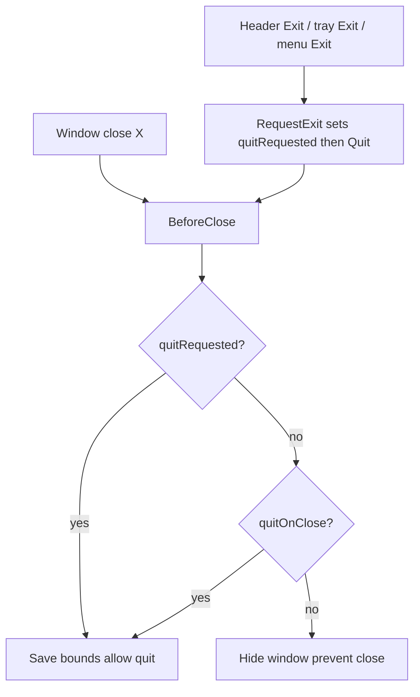

# Window lifecycle port from traytools-26

## What is being added

Header (right side, after existing stay-on-top / options / theme):

- **Exit** — visible only when “quit on close” is **off**; calls a real quit (not hide-to-tray).
- **Integrity badge (M/H)** — shows current process integrity; click toggles elevation (UAC restart), same as traytools.

Options dialog (existing [1-dialog-options.tsx](frontend/src/components/4-dialogs/1-dialog-options.tsx)):

- Run WinWatch elevated
- Make the window stay on top of all others (same state as the existing header button)
- Show application icon on the taskbar
- Quit the application when the window close button is clicked
- Show theme toggle button in header (checkbox only; no extra Theme dropdown)

Not ported (not highlighted / not applicable here): DPAgent elevated, main tabs, footer, Sync Check Details, unload-hook hotkey, unsaved-tabs quit prompt, command bus.

## Why a tray is required

In traytools, close-to-tray and hide-from-taskbar are only safe because a tray icon remains. This app currently always quits on close ([backend/app.go](backend/app.go) `BeforeClose` returns `false`) and has no tray.

Default matching traytools (and the screenshot with a visible Exit button):

- `quitOnClose` defaults **false** → window **X hides to tray**; header **Exit** is shown
- `showInTaskbar` defaults **true**
- Menu **Exit** and tray **Exit** must go through `RequestExit`, not `runtime.Quit` directly (otherwise X-hide and explicit quit would collide)

No frontend unsaved-quit dialog: this app has no dirty editor tabs. `RequestExit` sets `quitRequested` and calls `runtime.Quit` immediately (same outcome as traytools after an empty prompt).

## Isolation

**Frontend** — new folder `frontend/src/components/window-lifecycle/`:

- `a-atoms.ts` — Jotai atoms copied in spirit from [a-settings-atoms.tsx](C:/y/w/2-web/0-dp/utils/traytools-26/frontend/src/components/4-dialogs/8-3-settings/a-settings-atoms.tsx): `settingsRunElevatedAtom`, `appIsElevatedAtom`, `settingsQuitOnCloseAtom`, `settingsShowInTaskbarAtom`, plus thin Jotai wrappers over existing Valtio `appSettings` for stay-on-top and show-theme-toggle so the dialog can reuse one switch control
- `a-sync.tsx` — load-from-backend `useEffect` components (`AppIsElevatedSync`, `SettingsRunElevatedSync`, `SettingsQuitOnCloseSync`, `SettingsShowInTaskbarSync`)
- `a-bridge.ts` — Wails `App.*` wrappers with browser no-ops when `isBackgroundAvailable` is false
- `0-btn-exit.tsx`, `1-badge-self-integrity.tsx`, `2-integrity-badge.tsx` — UI (badge logic from traytools [2-integrity-badge.tsx](C:/y/w/2-web/0-dp/utils/traytools-26/frontend/src/components/1-header/4-dpagent-toolbar/2-integrity-badge.tsx))
- `3-option-switches.tsx` — the five option rows (switches + theme-toggle checkbox)
- `index.ts` — public exports

**Backend** — new package `backend/hostlife/` plus two small extensions of existing packages:

- `backend/winapp/` — taskbar Win32 (`WS_EX_APPWINDOW` / `WS_EX_TOOLWINDOW`) copied from [taskbar_windows.go](C:/y/w/2-web/0-dp/utils/traytools-26/backend/winapp/taskbar_windows.go)
- `backend/winlaunch/` — add `elevation_windows.go`, `elevation_other.go`, `explorer_parent_windows.go` from traytools (this package already exists for Explorer)
- `backend/hostlife/` — tray (`energye/systray`), show/hide/toggle, `BeforeClose` policy, `RequestExit`, elevation restart helpers, optional single-instance mutex so a second launch activates the existing window instead of a second tray icon
- [backend/appstate/bounds.go](backend/appstate/bounds.go) — add `runElevated`, `quitOnClose`, `showInTaskbar` to the existing `%AppData%/WinWatch/init.json` (one file, mutex already there)

Wails-bound methods stay on `backend.App` as thin delegates (do **not** add these to `bindings.Api`, which is the window-tree API). Existing [tmApi.quitApp](frontend/src/api/tmApi.wails.ts) / menu Exit will call `RequestExit`.

## State libraries

| Setting | Store | Why |
|---|---|---|
| stay on top, show theme toggle | existing Valtio `appSettings` | already localStorage UI prefs; stay-on-top already applied in [1-0-ui-settings.ts](frontend/src/store/1-0-ui-settings.ts) |
| run elevated, quit on close, show in taskbar, isElevated | Jotai write atoms | async backend side effects (persist + UAC restart), same pattern as traytools |
| no `useState` for this feature | | |

`ui_showThemeToggle` defaults **true** so the current always-visible moon/sun button does not disappear.

Elevation click path (preserve traytools): persist preference → `requestElevationRestart` / `requestUnelevatedRestart` → save window bounds first (`os.Exit` skips `BeforeClose`) → skip auto-elevate for `wails dev` (`-dev` in exe name).

## Wiring (small edits outside the new folders)

- [1-app-header.tsx](frontend/src/components/1-header/1-app-header.tsx) — render `ButtonExit` + `BadgeSelfIntegrity`; gate `ButtonThemeToggle` on `ui_showThemeToggle`
- [1-dialog-options.tsx](frontend/src/components/4-dialogs/1-dialog-options.tsx) — mount `window-lifecycle` option rows (leave existing Windows-list placeholder)
- [0-app-globals.tsx](frontend/src/components/4-dialogs/0-app-globals.tsx) — mount the four Sync components
- [1-top-menu.tsx](frontend/src/components/1-header/1-top-menu.tsx) — Exit uses `RequestExit`
- [backend/app.go](backend/app.go) / [main.go](main.go) — `EnsureElevatedIfRequested` before `wails.Run`; start/stop tray; `BeforeClose` hide-vs-quit; bind new `App` methods
- `go get github.com/energye/systray`; embed a Windows `.ico` for the tray (add `build/windows/icon.ico` / `build/appicon.png` if missing — Wails has not committed them here)

## Labels

- Settings: **Run WinWatch elevated** (not “TrayTools”)
- Badge subject: **WinWatch**
- Tray tooltip/title: **UI Automation Monitor** (matches window title in `main.go`)
